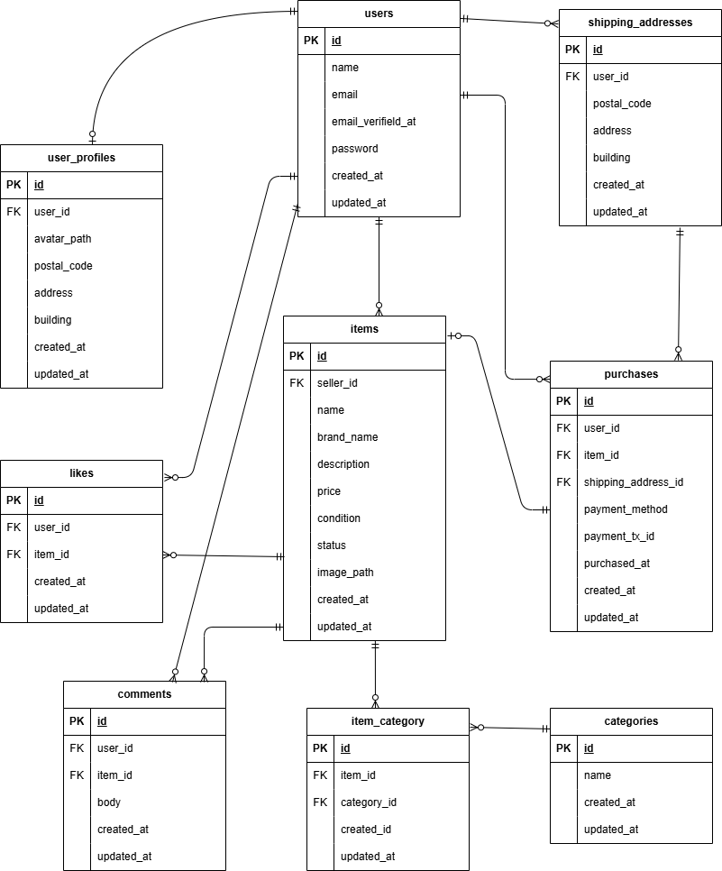

# フリマアプリ

## 環境構築

### Docker ビルド

1. リポジトリを取得

   ```bash
   git clone https://github.com/matsu-shima-130/freemarket-exam.git
   cd freemarket-exam
   ```

2. コンテナを作成・起動

   ```bash
   docker-compose up -d --build
   ```

   ※ MySQL は、OS によっては起動しない場合があるため、各 PC に合わせて docker-compose.yml を編集してください。

### Laravel 環境構築

1. PHP コンテナに入る

   ```bash
   docker-compose exec php bash
   ```

2. 依存パッケージのインストール & 環境ファイル作成

   ```bash
   composer install
   cp .env.example .env
   php artisan key:generate
   ```

3. `.env` の DB 設定（例）

   ```env
   DB_CONNECTION=mysql
   DB_HOST=mysql
   DB_PORT=3306
   DB_DATABASE=laravel_db
   DB_USERNAME=laravel_user
   DB_PASSWORD=laravel_pass
   ```

4. マイグレーション

   ```bash
   php artisan migrate
   ```

5. シーディング

   ```bash
   php artisan db:seed
   ```

## ダミーデータについて

- `php artisan db:seed` を実行すると、以下のテストデータが作成されます。
  - 出品者ユーザー（seller@example.com）
  - ダミー商品データ一式（画像付き）
  - 商品カテゴリデータ（ファッション / 家電 など）

## 追加機能

仕様書に明記されていないが、利便性向上のために以下の機能を追加しています。

- いいね・コメント時のフラッシュメッセージ表示
    - 商品詳細ページで、いいね／コメント送信後に結果をフラッシュメッセージで表示します。

- コメント削除機能
    - ログインユーザーが自分で投稿したコメントに限り、「削除」ボタンが表示され、削除できるようにしています。
    - Policy を用いて本人以外は削除できないよう制御しています。

- 購入完了時のフラッシュメッセージ表示
    - 商品購入処理完了後、商品一覧ページにリダイレクトすると同時に「購入が完了しました。」というフラッシュメッセージを表示します。

- 出品ページ（商品登録フォーム）に以下のバリデーションを設定しています。
   - 画像：必須
   - 商品名：必須
   - 価格：必須／数値
   - 商品の状態：必須
   - 説明：必須
- 商品データ仕様書の必須項目に合わせたバリデーションルールになっています。

## 開発環境（URL）

- 商品一覧（トップ画面）: http://localhost/
- 会員登録: http://localhost/register
- ログイン: http://localhost/login
- phpMyAdmin: http://localhost:8080/

### 主な画面

- プロフィール画面: http://localhost/mypage
- プロフィール編集画面: http://localhost/mypage/profile
- 商品出品画面: http://localhost/sell
- 商品詳細画面: http://localhost/item/{id}
  - 例）http://localhost/item/1
- 商品購入画面: http://localhost/purchase/{item_id}
  - 例）http://localhost/purchase/1
- 配送先変更画面: http://localhost/purchase/address/{item_id}
  - 例）http://localhost/purchase/address/1

## 使用技術（実行環境）

- PHP 8.1.33
- Laravel 8.83.8
- MySQL 8.0.26
- Nginx 1.21.1
- Docker / docker-compose
- Font Awesome（アイコン表示）

## ER 図

<!-- 作成したER図へのパスに合わせて修正してください -->


