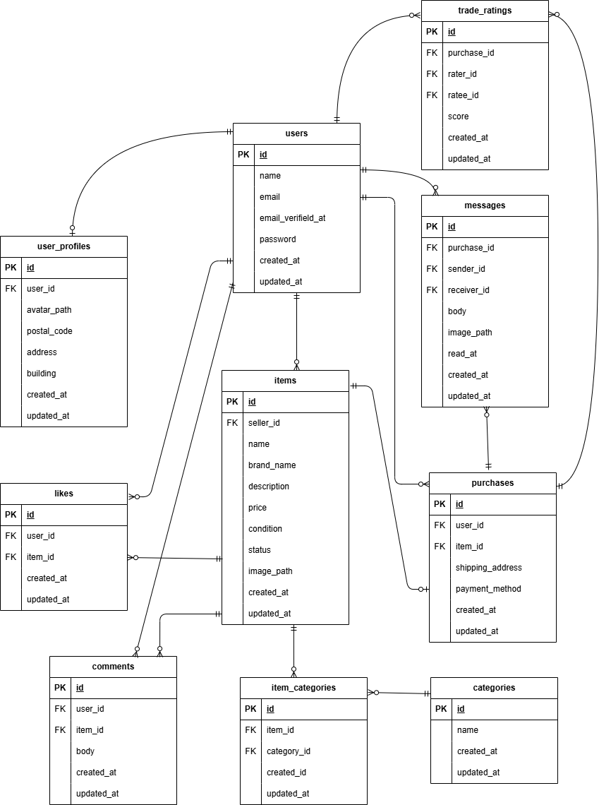

# フリマアプリ

## 環境構築

### Docker ビルド

1. リポジトリを取得

   ```bash
   git clone https://github.com/matsu-shima-130/freemarket-exam.git
   cd freemarket-exam
   ```

2. コンテナを作成・起動

   ```bash
   docker-compose up -d --build
   ```

   ※ MySQL は、OS によっては起動しない場合があるため、各 PC に合わせて docker-compose.yml を編集してください。

### Laravel 環境構築

1. PHP コンテナに入る

   ```bash
   docker-compose exec php bash
   ```

2. 依存パッケージのインストール & 環境ファイル作成

   ```bash
   composer install
   cp .env.example .env
   php artisan key:generate
   ```

3. `.env` の DB 設定（例）

   ```env
   DB_CONNECTION=mysql
   DB_HOST=mysql
   DB_PORT=3306
   DB_DATABASE=laravel_db
   DB_USERNAME=laravel_user
   DB_PASSWORD=laravel_pass
   ```

4. マイグレーション

   ```bash
   php artisan migrate
   ```

5. シーディング

   ```bash
   php artisan db:seed
   ```

6. ストレージ公開（画像表示用）

   ```bash
   php artisan storage:link
   ```

7. メール送信設定（Mailtrap）

- メール認証機能には Mailtrap を使用しています。
- Mailtrap でテスト用アカウントを作成し、SMTP の接続情報を取得します。
- .env を以下のように設定します（値は Mailtrap 上のものに置き換えてください）。
  ```bash
  MAIL_MAILER=smtp
  MAIL_HOST=sandbox.smtp.mailtrap.io
  MAIL_PORT=2525
  MAIL_USERNAME=xxxxxxxxxxxxxxxx
  MAIL_PASSWORD=yyyyyyyyyyyyyyyy
  MAIL_ENCRYPTION=tls
  MAIL_FROM_ADDRESS=no-reply@example.com
  MAIL_FROM_NAME="Freemarket-exam"
  ```
- 設定反映
  ```bash
  php artisan config:clear
  ```
- 会員登録後、/email/verify に遷移し、Mailtrap の受信ボックスに届いたメールから認証リンクをクリックするとメール認証が完了します。

8. テスト用DBの作成

- テストでは`.env.testing` を利用して `demo_test` データベースに接続します。
- 初回のみ、MySQL にテスト用DBを作成してください。

  **※ここからは一度 PHP コンテナを出て、ホスト（自分のPCのターミナル）で作業します。**
  1. PHPコンテナから退出：

     ```bash
     exit
     ```

  2. MySQL に root でログイン（パスワードは docker-compose.yml の設定により異なる場合があります）

     ```bash
     docker compose exec mysql mysql -u root -proot
     ```

  3. テスト用DB作成

     ```bash
     CREATE DATABASE IF NOT EXISTS demo_test;
     exit
     ```

  4. PHPコンテナに入る

     ```bash
     docker-compose exec php bash
     ```

  5. マイグレーション（testing 環境）

     ```bash
     php artisan config:clear
     php artisan migrate --env=testing
     ```

9. 決済処理（Stripe）

- 購入処理には Stripe Checkout（テストモード）を使用しています。
- Stripe アカウントを作成し、ダッシュボードを テストモード に切り替えます。
- 「開発者」→「API キー」から以下のキーを取得します。
  - 公開可能キー（Publishable key）
  - シークレットキー（Secret key）
- .env に追記します。
  ```bash
  STRIPE_KEY=pk_test_xxxxxxxxxxxxxxxxx
  STRIPE_SECRET=sk_test_yyyyyyyyyyyyyyyy
  ```
- 設定反映
  ```bash
  php artisan config:clear
  ```

10. テスト

- PHPUnit による Feature テストを実装しています。
  ```bash
  docker-compose exec php bash
  php artisan test
  ```
- 特定のテストクラスだけ実行したい場合は --filter を使用します。

  ```bash
  特定のテストクラスだけ実行したい場合は --filter を使用します。
  # ID2 ログイン機能
  php artisan test --filter=LoginTest

  # ID3 ログアウト機能
  php artisan test --filter=LogoutTest

  # ID4 商品一覧取得
  php artisan test --filter=ItemListTest

  # ID5 マイリスト一覧取得
  php artisan test --filter=MylistTest

  # ID6 商品検索機能
  php artisan test --filter=ItemSearchTest

  # ID7 商品詳細情報取得
  php artisan test --filter=ItemShowTest

  # ID8 いいね機能
  php artisan test --filter=LikeTest

  # ID9 コメント送信機能
  php artisan test --filter=CommentTest

  # ID10 商品購入機能
  php artisan test --filter=PurchaseTest

  # ID11 支払い方法選択機能
  php artisan test --filter=PaymentMethodTest

  # ID12 配送先変更機能
  php artisan test --filter=PurchaseAddressTest

  # ID13 ユーザー情報取得
  php artisan test --filter=MypageProfileTest

  # ID14 ユーザー情報変更
  php artisan test --filter=MypageProfileEditTest

  # ID15 出品商品情報登録
  php artisan test --filter=ItemStoreTest

  # ID16 メール認証機能
  php artisan test --filter=EmailVerificationTest
  ```

  - テスト内容はテストケース一覧に準拠しています。

## ダミーデータについて

- `php artisan db:seed` を実行すると、以下のテストデータが作成されます。

### ユーザー（3件）

| 区分     | 名前             | メールアドレス        | パスワード  | 備考                   |
| -------- | ---------------- | --------------------- | ----------- | ---------------------- |
| 出品者A  | 出品者A          | seller_a@example.com  | password123 | 商品 CO01〜CO05 を出品 |
| 出品者B  | 出品者B          | seller_b@example.com  | password123 | 商品 CO06〜CO10 を出品 |
| 未紐づけ | 未紐づけユーザー | user_free@example.com | password123 | 出品・購入など未紐づけ |

### カテゴリ

- ファッション / 家電 / インテリア / レディース / メンズ / コスメ / 本 / ゲーム / スポーツ / キッチン / ハンドメイド / アクセサリー / おもちゃ / ベビー・キッズ

### 商品（10件）

- 腕時計 / HDD / 玉ねぎ3束 / 革靴 / ノートPC / マイク / ショルダーバッグ / タンブラー / コーヒーミル / メイクセット
- 画像は `storage/app/public/items` 配下へコピーされ、DBには `items/{ファイル名}` 形式で保存されます。

## 追加機能実装

- マイページの「取引中の商品」タブから、取引チャット画面へ遷移できます。
- 「取引中の商品」には、購入済み（Purchaseが作成されている）取引が表示されます。
- 取引チャット画面の「その他の取引」には、自分が関わっている取引（購入者・出品者の両方）が一覧表示され、別の取引チャットへ切り替えできます。

## 開発環境（URL）

- 商品一覧（トップ画面）: http://localhost/
- 会員登録: http://localhost/register
- ログイン: http://localhost/login
- phpMyAdmin: http://localhost:8080/

## 使用技術（実行環境）

### バックエンド/インフラ

- PHP 8.1.33
- Laravel 8.83.8
- MySQL 8.0.26
- Nginx 1.21.1
- Docker / docker-compose

### ライブラリ・パッケージ

- Laravel Fortify（認証・メール認証）
- stripe/stripe-php（決済連携）

### 外部サービス

- Mailtrap（メール送信テスト環境）
- Stripe（テスト決済）

### フロントエンド

- Font Awesome（アイコン表示）

## ER 図


